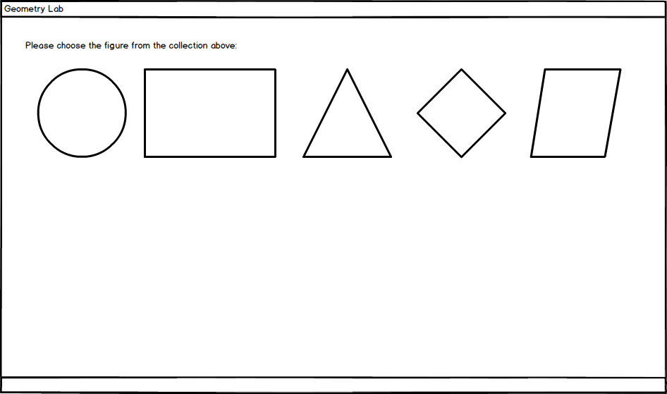
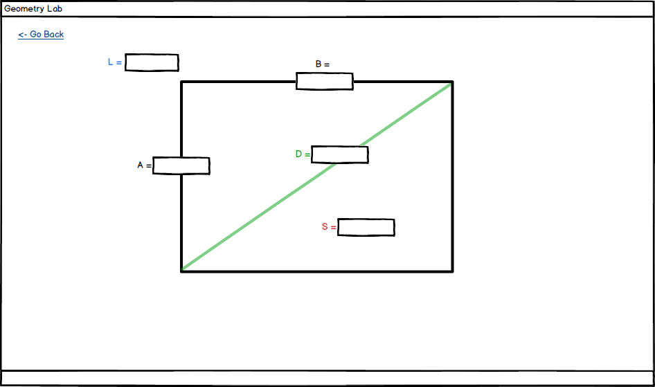

# Geometry Lab

## Overview
The applications allows pupils to enter the world of Geometry easily providing the opportunity to to study & do experiments with different shapes.

## Landing / Home Page
Lists all the available shapes on the screen.

## Shape - Circle
When the user selects the shape (_Circle_, for instance) new page is shown.
The page presents a graphical representation of the shape and allows the user to enter different parameters (_R_-radius, _D_-diametr, etc.).

Each time the user enters the value in one of the available inputs, the application must evaluate what parameters can it automatically calculated based on entered values in all fields.

In this concrete example for the _Circle_, as soon as the user enters any value for the _Radius_ (_R_) - the system calculates all other parameters (_L_, _D_, _S_) and present them in the input fields.

_Go Back_ button / link returns the user to the Landing / Home Page.

# Share - Rectangle & Other Shapes
_Rectangle_ (and all other shapes) follows the same principles as for the _Circle_.

# Interactive Mockups
[Pdf document](./resources/Geometry%20Lab.pdf) contains navigation areas you can use to navigate through the pages.

# Getting Started
Fork the current repository and continue working in your private one.

The source code of the bootstrap application in the _/src_ folder.

## Technology Stack
.NET 6
Windows Forms